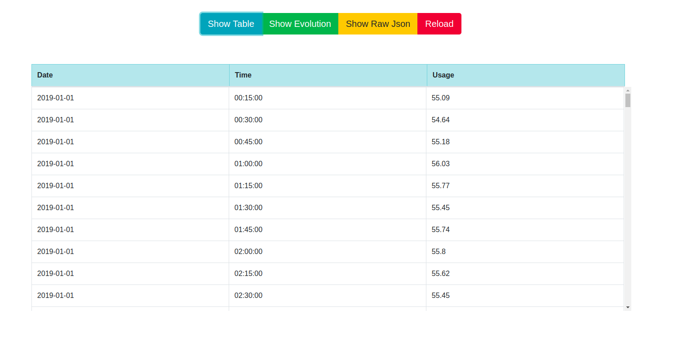
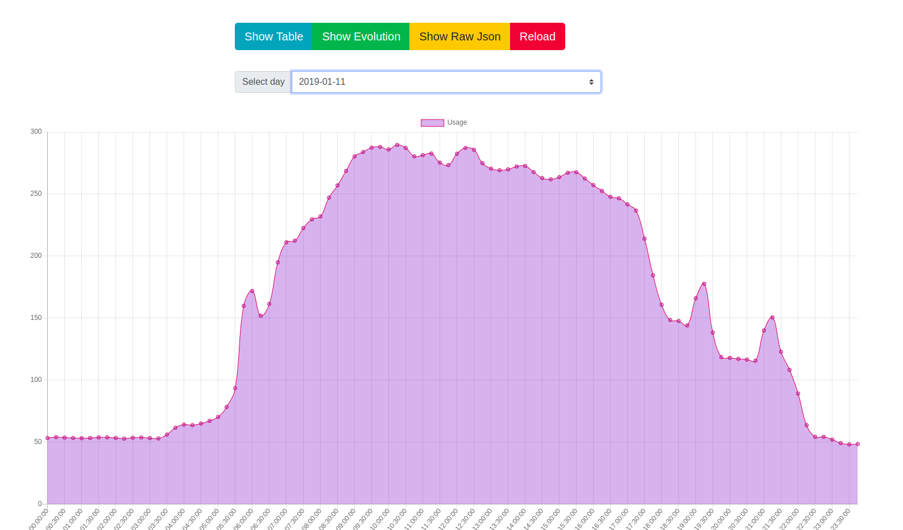
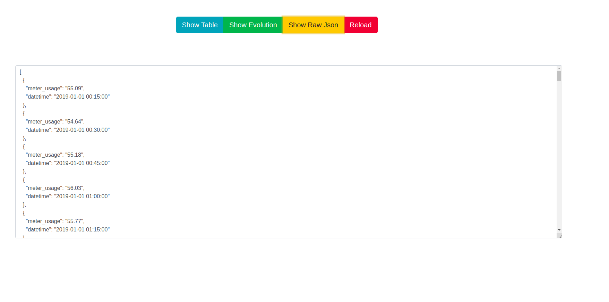

# grpc-server

# Introduction

The purpose of this project is, broadly, to display the data stored in a csv
file in a more readable format. We are displaying the data using a table
format, a chart but we can also see a json version of the csv that contains all
the data.

We have the following components:

1. gRPC server 
2. gRPC client (also acts as HTTP client)
3. web client

The gRPC server has a single method, responsable with reading the data from
the file that contains it and sending it as string to the gRPC client when
it's requested.

The second component has a dual role. First, it is the client for the gRPC
server. Secondly, it acts an a HTTP server for the web client. It's role is
to take the string passed by the gRPC server, convert it to json and then
pass it to the web client.

The web client is responsible with displaying the data. It receives it from
the server and shows it in the various forms we mentioned above. In the Results
sections we have a few pictures with the way in which the data is displayed.

# Installation and Running

In order to run this example, we need to install gRPC for Python, following the
instructions from the [official website](https://grpc.io/docs/languages/python/quickstart/)

After, we have to generate the grpc files, using the following command (which is
adapted from the one [there](https://grpc.io/docs/languages/python/quickstart/) ):

`
python -m grpc_tools.protoc -I. --python_out=. --grpc_python_out=. usage.proto 
`

The files generated will be *usage_pb2_grpc.py*, *usage_pb2_grpc.pyc* and *usage_pb2.pyc*.

Besides, you should also install [Flask](https://flask.palletsprojects.com/en/1.1.x/) and [Flask-Cors](https://flask-cors.readthedocs.io/en/latest/) using pip. When developing, 
[Python 3.5.2](https://www.python.org/downloads/release/python-352/) was used.

The web client is using [jquery](https://jquery.com/), [Bootstrap](https://getbootstrap.com/) and [Chart.js](https://www.chartjs.org/), but those are included
using links, so nothing should be downloaded for the client to run. 

The program had been tested on [Firefox](https://www.mozilla.org/en-US/firefox/new/) and [Chromium](https://www.chromium.org/).

To run, open a terminal and write in it:

`
python usage_server.py
`

and then another terminal, where you run:

`
python usage_client.py
`

Then, open the index file in a browser. You should see the results diplayed in the browser.

# Results

In the pictures below, you can see the results.

We have three possible views in which we can see the data from the original csv file.

The first one is the table, where we have the date, time and usage as columns.

The second one is a linear plot per day. The decision to plot per day has been
taken because of the big number of entries, as they weren't fiting on a single plot.

The last view is showing the raw json.

We also have the reload button, that is making another request to the server
and it's reinitializing the data. Because our data is in a file that does not 
change, the effects won't be visible. However, had we used dynamic data,
they would have been.

# Acknowledgements

In creating this project, I used [gRPC for Python](https://grpc.io/docs/languages/python/quickstart/),
[Flask](https://flask.palletsprojects.com/en/1.1.x/), [Flask-Cors](https://flask-cors.readthedocs.io/en/latest/),
[Python 3.5.2](https://www.python.org/downloads/release/python-352/), [jquery](https://jquery.com/), 
[Bootstrap](https://getbootstrap.com/) and [Chart.js](https://www.chartjs.org/).

The communication between the gRPC server and client is based on the one from the
[official examples](https://github.com/grpc/grpc/tree/master/examples/python/helloworld). 
